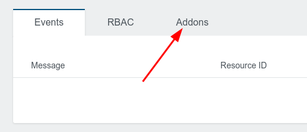

# Addons

```bash
cd ~/08_addons
```

## Make use of an existing Addon

Click on the tab `Addons` within a cluster:



Click the `Install Addon` button and add the Addon `cluster-autoscaler`. Choose the option `Continuously reconcile addon`.

Click on the tab `Open Dashboard`:


Choose `All Namespaces` in the Namespace Dropdown and select Pods in the Side Panel.

## Add a custom Addon

Take a look into `./addons/my-addon/pod.yaml`.

### Create a Docker Container

There should be zero images.

```bash
# Verify that there are no images in the 
gcloud container images list --repository=$REPO_URL

# Build and push the new addon image
cd addons
docker build -t $REPO_URL/kkp-addons:v2.20.4-v0.0.1 .
docker push $REPO_URL/kkp-addons:v2.20.4-v0.0.1
cd ..

# Verify the image exists in the repository
gcloud container images list --repository=$REPO_URL
```

### Adapt the Kubermatic Configuration

You have to add the following block in the section `spec` in the file `kubermatic.yaml`. Also ensure that you change the PROJECT_ID.

```yaml
userCluster:
  addons:
    dockerRepository: gcr.io/<PROJECT_ID>/kkp-addons
    dockerTagSuffix: "v0.0.1"
api:
  accessibleAddons:
    - cluster-autoscaler
    - my-addon
```

```bash
# Apply the adapted configuration
kubectl apply -f ~/kkp/kubermatic.yaml

# Ensure that the kubermatic-seed-controller-manager-XXXXX gets restarted
kubectl -n kubermatic get pods

# Verify that the manifests of my-addon are present
kubectl -n kubermatic exec -it kubermatic-seed-controller-manager-XXXXX -- cat /opt/addons/my-addon/pod.yaml
```

### Customize your Addon

```bash
# You can customize the icon of the image via encoding eg a png image via base64. Note the AddonConfig already contains this image in the field `spec.logo`
cat logo_32x32.png | base64 -w0 

kubectl apply -f ~/kkp/my-addon.yaml
```

Finally you can add your Addon in the UI. Apply the Addon and verify in the Kubernetes Dashboatd if your Pod is running.

Jump > [Home](../README.md) | Previous > [Upgrade KKP](../07_upgrade_kkp/README.md) | Next > [OAuth](../09_oauth/README.md)
